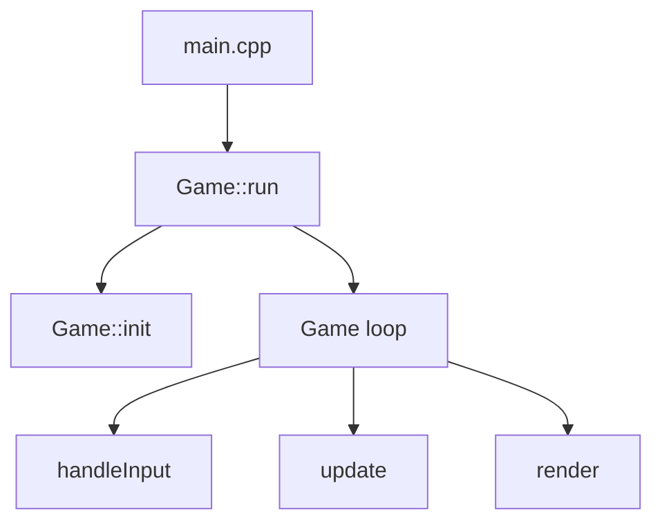
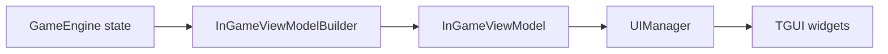
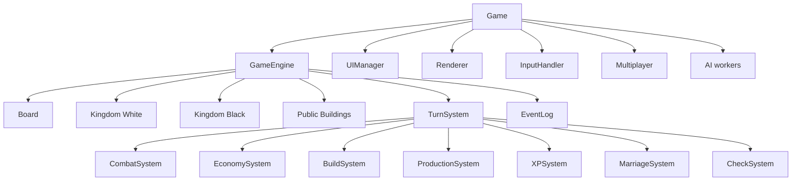

# Rapport d'analyse technique - A Normal Chess Game

Date: 2026-04-15

## 1. Objet du rapport

Ce rapport a pour but d'expliquer en profondeur comment fonctionne le projet A Normal Chess Game, quels sont ses mecanismes de jeu, comment le code est structure, et ou se situe le vrai coeur de la game engine.

Le rapport est base sur une analyse statique du depot courant. Il decrit donc le comportement implemente dans le code source visible, sans supposer des modules externes non presents dans ce workspace.

## 2. Resume executif

Le projet n'est pas un jeu d'echecs classique. C'est plutot un jeu de strategie au tour par tour inspire des echecs, melange avec:

- une economie de ressources
- des batiments construisables et destructibles
- une generation procedurale de carte
- une progression d'unites par XP
- une IA strategique multi-couche
- un mode LAN avec hote autoritaire

L'architecture du projet repose sur une separation assez nette entre:

- `Game`, qui orchestre la fenetre, l'input, l'UI, le rendu, l'IA asynchrone, les sauvegardes et le multiplayer
- `GameEngine`, qui porte l'etat metier de la partie
- `TurnSystem` et les sous-systemes, qui appliquent effectivement les regles du jeu

Le vrai coeur moteur n'est donc pas la boucle SFML, mais l'ensemble `GameEngine + TurnSystem + Board + Kingdom + Systems`.

Le point fort principal du projet est cette separation entre orchestration et logique metier. Les principaux points de fragilite sont:

- `Game` reste un gros orchestrateur tres charge
- le plateau stocke des pointeurs bruts vers des objets possedes ailleurs
- certains sous-systemes semblent partiellement integres seulement
- les parseurs JSON maison sont efficaces mais fragiles et peu extensibles
- la configuration IA a deja une derive entre JSON et code consomme

## 3. Nature reelle du jeu

### 3.1 Ce que le jeu est vraiment

Le nom suggere un jeu d'echecs normal, mais le code montre autre chose:

- la carte est circulaire, pas un echiquier 8x8
- il existe plusieurs types de terrain: herbe, terre, eau, vide
- on peut construire des barracks, murs et arenes
- on gagne de l'or en occupant des mines et fermes publiques
- on produit de nouvelles unites dans les barracks
- les pieces gagnent de l'XP et evoluent
- la reine ne se produit pas: elle apparait via un mecanisme de mariage

Le projet est donc un hybride entre:

- jeu d'echecs abstrait
- jeu de conquete territoriale
- jeu de gestion economique leger
- jeu tactique au tour par tour

### 3.2 Boucle strategique globale

La boucle strategique implicite du jeu, telle qu'on la lit dans le code, ressemble a ceci:

1. Debut de partie avec seulement un roi par royaume.
2. Deplacement du roi pour prendre position sur la carte.
3. Occupation de mines et fermes pour generer de l'or.
4. Construction de barracks et eventuellement de murs/arenes.
5. Production d'unites.
6. Progression des unites par combat et XP.
7. Conversion eventuelle d'un pion en reine via l'eglise.
8. Pression tactique puis recherche du mat sur le roi adverse.

Cette lecture est confirmee par les valeurs par defaut:

- `starting_gold = 0`
- `num_mines = 2`
- `num_farms = 3`
- une seule piece initiale par camp: le roi

Autrement dit, l'ouverture n'est pas une ouverture d'echecs, mais une ouverture d'expansion economique et de prise de position.

## 4. Architecture generale du logiciel

### 4.1 Vue d'ensemble

La structure logicielle suit un modele objet classique, pas un ECS.

Les grands modules sont:

- `Core/`: orchestration de partie, etat global, validation, session
- `Board/`: plateau, cellules, generation procedurale
- `Kingdom/`: etat de chaque camp
- `Units/`: pieces, types et regles de mouvement
- `Buildings/`: batiments, types, factory et registre graphique
- `Systems/`: application des regles du jeu
- `AI/`: IA legacy et IA moderne
- `Input/`: selection, previsualisation, construction, camera
- `Render/`: camera, rendu du monde et overlays
- `UI/`: interface TGUI
- `Save/`: serialisation JSON
- `Multiplayer/`: client/serveur LAN

### 4.2 Build et composition du binaire

Le `CMakeLists.txt` visible dans ce depot construit:

- une bibliotheque statique `ANormalChessGameCore`
- un executable `ANormalChessGame`
- un executable `ANormalChessGameTests`

La bibliotheque coeur contient tout `src/*.cpp` sauf `src/main.cpp`.

Cette decision est importante car elle formalise de fait une separation entre:

- le coeur reusable du jeu
- le point d'entree executable
- la couche tests

Le runtime cible visible dans le depot courant est un frontend desktop SFML + TGUI.

## 5. Flux d'execution principal

### 5.1 Point d'entree

Le point d'entree est minimal:

- `main.cpp` construit un objet `Game`
- `main.cpp` appelle `game.run()`

Tout le reste part de la classe `Game`.

### 5.2 Boucle principale

La boucle runtime suit le schema suivant:

`Game::run()` ouvre la fenetre, charge les configs, initialise les assets, le renderer, la camera et l'UI, puis entre dans une boucle:

- mise a jour de l'horloge
- lecture des evenements
- update logique
- rendu

### 5.3 Etats de haut niveau

Le jeu manipule un `GameState` avec au moins ces etats:

- `MainMenu`
- `Playing`
- `Paused`
- `GameOver`

Le changement d'etat est gere dans `Game`, pas dans `GameEngine`.

Cela confirme un point cle:

- `GameEngine` ne gere pas une scene temps reel ni une machine d'etat d'UI
- `GameEngine` represente l'etat metier d'une session de jeu

## 6. La vraie game engine

### 6.1 Ce que contient `GameEngine`

`GameEngine` possede l'etat durable de la partie:

- `Board`
- les deux `Kingdom`
- la liste des batiments publics
- `TurnSystem`
- `EventLog`
- `PieceFactory`
- `BuildingFactory`
- `GameSessionConfig`

Il expose quatre responsabilites principales:

- demarrer une session neuve
- restaurer une sauvegarde
- produire un snapshot de sauvegarde
- valider l'etat runtime

### 6.2 Ce que `GameEngine` ne fait pas

`GameEngine` ne gere pas:

- la fenetre
- les events SFML
- TGUI
- le rendu
- l'IA asynchrone
- le reseau
- les callbacks de menu

Toutes ces responsabilites restent dans `Game`.

### 6.3 Conclusion moteur

Le coeur moteur est un moteur de regles et d'etat, pas un moteur generaliste type Unity-like.

On peut le decrire comme un moteur:

- stateful
- imperative
- commande-par-commande
- centre sur le commit de tour

Le point de passage essentiel est `TurnSystem::commitTurn()`.

## 7. Modele de donnees

### 7.1 Plateau

Le plateau est une grille carree contenant un disque jouable:

- `Board::init(radius)` cree une grille de taille `radius * 2`
- les cellules hors disque sont marquees `Void`
- les cellules dans le disque sont jouables et initialement en `Grass`

Cela donne un monde circulaire, ce qui change fortement la strategie spatiale par rapport a un echiquier.

Chaque `Cell` contient:

- son `CellType`
- un pointeur vers un `Building`
- un pointeur vers une `Piece`
- un bool `isInCircle`
- sa position

### 7.2 Royaumes

Chaque `Kingdom` contient:

- son identifiant (`White` ou `Black`)
- son or
- ses pieces
- ses batiments possedes

Le royaume ne connait pas l'UI ni le controle humain/IA. Cette information est dans la config de session et dans `LocalPlayerContext`.

### 7.3 Pieces

Une `Piece` contient:

- `id`
- `type`
- `kingdom`
- `position`
- `xp`
- `formationId`

Types supportes:

- Pawn
- Knight
- Bishop
- Rook
- Queen
- King

### 7.4 Batiments

Un `Building` contient:

- `id`
- `type`
- `owner`
- `isNeutral`
- `origin`
- `width`, `height`
- `cellHP` pour chaque cellule du footprint
- etat de production pour les barracks

Le jeu gere donc de vrais batiments multi-cellules, pas de simples tuiles symboliques.

### 7.5 Observations de conception

Le plateau ne possede pas directement les pieces et batiments. Il ne stocke que des pointeurs vers des objets possedes ailleurs.

Le systeme de reliaison `relinkBoardState(...)` reconstruit ces pointeurs apres:

- une nouvelle partie
- un chargement de sauvegarde
- la creation d'un snapshot pour l'IA

Cette architecture est simple et performante en lecture, mais fragile si les conteneurs proprietaires reallouent en memoire.

Point notable:

- les pieces sont stockees dans `std::deque`, ce qui limite les problemes de stabilite d'adresse
- les batiments de royaume sont stockes dans `std::vector`, ce qui introduit un risque potentiel de pointeurs invalides dans les cellules si le vecteur realloue

Ce n'est pas forcement un bug manifeste a chaque partie, mais c'est une fragilite structurelle importante de l'engine.

## 8. Mecanismes de jeu

### 8.1 Generation du monde

La carte est generee proceduralement dans `BoardGenerator`.

Le generateur:

- initialise le disque jouable
- applique une base d'herbe
- genere terre et eau avec du bruit fractal
- protege les couloirs de spawn
- place des batiments publics neutres
- choisit les points de spawn des deux camps

Le tout est seed-driven via `worldSeed`, ce qui permet:

- la reproductibilite
- les tests deterministes
- la sauvegarde fiable du monde

Les batiments publics places par generation sont:

- `Church`
- `Mine`
- `Farm`

### 8.2 Debut de partie

Une nouvelle session cree:

- un royaume blanc avec un roi
- un royaume noir avec un roi
- l'or de depart selon config

Dans la configuration par defaut actuelle:

- l'or initial est `0`
- le joueur ne commence pas avec une armee

Cela force une phase d'ouverture orientee exploration et occupation de structures publiques.

### 8.3 Regles de mouvement

Les regles de mouvement sont inspirees des echecs, mais adaptees au monde tactique:

- le pion se deplace orthogonalement d'une case
- le cavalier suit un mouvement de cavalier classique
- le fou se deplace en diagonale
- la tour en ligne droite
- la reine combine fou + tour
- le roi se deplace d'une case autour de lui

Specificites importantes:

- l'eau bloque le mouvement
- les murs bloquent le mouvement sauf s'ils sont une cible ennemie attaquable
- une piece amie bloque la case
- la portee glissante est plafonnee par `global_max_range`, a `8` par defaut

Le jeu n'essaie donc pas de reproduire les echecs purs. Il prend une grammaire de mouvement d'echecs et la replonge dans un systeme de terrain et de constructions.

### 8.4 Check et checkmate

Le roi adverse ne peut pas etre capture. Le code l'interdit explicitement.

La condition terminale est:

- `CheckSystem::isCheckmate(...)`

Le moteur considere donc que la victoire se fait par mat, pas par destruction du roi.

Le calcul de mat suit un schema classique mais brut:

- verifier si le roi est en echec
- enumerer tous les mouvements possibles du camp
- simuler chaque mouvement temporairement
- verifier si un mouvement sort de l'echec

Cette approche est lisible et robuste pour un jeu tour par tour, mais pas particulierement optimisee.

### 8.5 Systeme de tour

Le `TurnSystem` est l'epine dorsale du gameplay.

Il maintient:

- le camp actif
- le numero de tour
- une liste de `TurnCommand`

Le systeme permet de mettre en file des commandes de types:

- `Move`
- `Build`
- `Produce`
- `Upgrade`
- `Marry`
- `FormGroup`
- `BreakGroup`

Regles clefs:

- une seule commande `Move` par tour
- une seule commande `Build` par tour
- une seule commande `Marry` par tour
- la production est autorisee une fois par barracks, pas une fois globalement

Cette regle du "one move per turn" est capitale. Elle donne au jeu un rythme tres different d'un RTS ou d'un tactics game ou toute l'armee agit a chaque tour.

En pratique, un tour peut combiner:

- un deplacement majeur
- une construction
- plusieurs productions en parallele dans differents barracks
- un upgrade
- un mariage

Cela cree un design macro-tactique original: l'action militaire directe est rare, mais l'economie et la preparation restent actives.

### 8.6 Ordre d'execution d'un tour

Lors du commit, `TurnSystem::commitTurn()`:

1. Parcourt les commandes en attente.
2. Applique deplacement, construction, production, upgrade et mariage.
3. Fait avancer les productions de barracks.
4. Fait apparaitre les unites produites si un spawn est libre.
5. Supprime les batiments detruits.
6. Credite les revenus.
7. Donne l'XP d'arene.
8. Vide la file de commandes.

Ce point est central pour comprendre l'engine:

- l'input ne modifie pas le monde de maniere definitive
- l'input prepare des commandes
- le commit du tour applique les vraies regles

### 8.7 Combat

Le combat est integre au deplacement.

Quand une piece se deplace vers une case cible:

- si un ennemi non-roi est present, il est capture
- si un batiment ennemi destructible est present, une cellule du batiment est endommagee

Batiments destructibles geres explicitement par `CombatSystem`:

- `WoodWall`
- `StoneWall`
- `Barracks`

Cela signifie qu'au moins dans le code actuel, tous les batiments possedes ne sont pas traites de la meme facon en combat.

Le combat donne de l'XP:

- XP de kill selon le type de piece detruite
- XP de destruction de bloc pour les batiments

### 8.8 Economie

L'economie repose sur les batiments publics, pas sur un revenu passif abstrait.

`EconomySystem` calcule le revenu ainsi:

- seules les `Mine` et `Farm` comptent
- il faut des pieces amies sur les cellules du batiment
- si des pieces des deux camps sont presentes, le batiment est conteste et ne rapporte rien
- le revenu depend du nombre de cellules amies occupees

Valeurs par defaut:

- mine: `10` or par cellule et par tour
- farm: `5` or par cellule et par tour

Ce mecanisme rend le controle de zone concret, puisqu'il faut physiquement occuper des cellules de structure.

### 8.9 Construction

`BuildSystem` impose plusieurs contraintes:

- budget suffisant
- toutes les cellules du footprint doivent etre libres
- pas d'eau
- batiment entier dans le disque jouable
- le roi constructeur doit etre adjacent au footprint

Batiments construisables pris en charge:

- `Barracks`
- `WoodWall`
- `StoneWall`
- `Arena`

Le fait que la construction soit liee a l'adjacence du roi renforce son role de piece logistique et territoriale, pas seulement de condition de victoire.

### 8.10 Production

La production se fait uniquement dans les barracks.

Le systeme gere:

- verif des couts
- demarrage d'une file de production par barracks
- decompte des tours restants
- tentative d'apparition sur une cellule adjacente libre

Temps de production par defaut:

- Pawn: 2 tours
- Knight: 4 tours
- Bishop: 4 tours
- Rook: 6 tours

Il n'y a pas de production de reine ni de roi.

### 8.11 XP et evolution des pieces

Le jeu ajoute une boucle RPG legere:

- les pieces gagnent de l'XP en tuant ou en detruisant
- les arenes donnent aussi de l'XP passive

Chaine d'evolution actuelle:

- Pawn -> Knight ou Bishop
- Knight -> Rook
- Bishop -> Rook

Seuils par defaut:

- Pawn vers Knight/Bishop: `100 XP`
- Knight/Bishop vers Rook: `300 XP`

La reine ne vient pas de cette chaine.

### 8.12 Mariage

Le mariage est un mecanisme tres atypique.

Conditions:

- le batiment doit etre une `Church`
- le royaume ne doit pas deja posseder de reine
- un roi, un fou et un pion allies doivent etre sur les cases de l'eglise
- le pion et le roi doivent etre adjacents
- aucun ennemi ne doit occuper l'eglise

Effet:

- le pion devient une reine

Ce mecanisme donne au jeu une identite tres forte. Il remplace une partie de la logique promotionnelle classique des echecs par une logique rituelle et spatiale.

### 8.13 Formations

Le code contient un `FormationSystem` qui sait:

- verifier si plusieurs pieces sont adjacentes
- creer un groupe logique
- casser un groupe

Mais dans l'etat actuel du depot, cette capacite parait partielle:

- les commandes `FormGroup` et `BreakGroup` existent
- `TurnSystem::commitTurn()` ne les traite pas explicitement
- aucune integration forte n'apparait dans la boucle de jeu analysee

Conclusion:

- la notion de formation existe dans le modele
- elle ne semble pas encore etre un mecanisme central pleinement branche

## 9. Input, camera, rendu et UI

### 9.1 Input joueur

`InputHandler` gere:

- selection de piece
- selection de batiment
- selection de cellule vide
- preview de deplacement
- preview de capture
- preview de construction
- deplacement camera a la souris et au clavier

Un point de design interessant est la previsualisation live du mouvement:

- le mouvement est applique visuellement avant le commit
- la commande de tour memorise l'origine et la destination
- le joueur peut retarget ou annuler avant validation

Cela donne une sensation plus moderne qu'un simple clic sec sur une grille.

### 9.2 Raccourcis significatifs

Les raccourcis importants visibles dans le code sont:

- `Escape`: menu en jeu
- `Space`: commit du tour
- `K`: recentrer la camera sur le royaume local
- `P`: export debug
- `ZQSD`: pan camera au clavier

### 9.3 Camera

La `Camera` assure:

- zoom
- pan
- conversion ecran -> monde
- conversion monde -> cellule

Le moteur de rendu s'appuie donc sur une vraie couche de transformation, pas sur un simple rendu en coordonnees ecran brutes.

### 9.4 Rendu

Le `Renderer` separe le monde en couches:

- fond du monde et plateau
- batiments
- pieces
- overlays

Les overlays affichent notamment:

- cellule d'origine d'une piece selectionnee
- cases atteignables
- cases dangereuses pour le roi
- cadre de selection
- preview de construction
- indicateurs de zones

### 9.5 UI TGUI

`UIManager` pilote l'interface TGUI:

- menu principal
- HUD
- menu en jeu
- panel piece
- panel batiment
- panel barracks
- panel build tool
- panel cellule
- historique d'evenements
- statut multiplayer

L'UI lit l'etat du moteur via un `InGameViewModel` construit a chaque update.

Le flux est donc:

Cette approche isole raisonnablement la presentation de l'etat brut.

## 10. Intelligence artificielle

### 10.1 Deux IA coexistantes

Le projet garde deux chemins IA:

- `AIController`: IA legacy
- `AIDirector`: IA moderne, active par defaut via `use_new_ai = true`

### 10.2 Execution asynchrone

L'IA calcule son tour sur un thread detache a partir d'une copie du monde.

Cela evite de bloquer la boucle principale. La logique est:

1. `Game` detecte qu'un camp IA est actif.
2. Il cree un snapshot local du monde.
3. Il lance un worker IA dans un thread.
4. Il poll l'etat de la tache.
5. Quand le plan est pret, il l'injecte dans `TurnSystem`.
6. Il commit le tour IA avec exactement le meme pipeline que pour le joueur.

Ce point est tres sain architecturalement: l'IA ne bypass pas les regles du jeu.

### 10.3 Structure de l'IA moderne

`AIDirector` suit une pipeline explicite:

- solver de mat
- choix d'objectif strategique
- MCTS pour le mouvement tactique
- modules secondaires pour build, production, mariage, etc.

Les objectifs strategiques declaratifs incluent notamment:

- attaque rapide
- expansion eco
- construction d'armee
- infrastructure
- poursuite de la reine
- defense du roi
- pression de mat
- contestation de ressources
- regroupement

Cette IA est donc organisee en couches:

- lecture strategique du tour
- evaluation tactique
- composition d'un plan de commandes

### 10.4 Snapshot et simulation

L'IA s'appuie sur:

- `GameSnapshot`
- `ForwardModel`
- `AIMCTS`

Le design est bon: au lieu de muter le vrai monde, l'IA simule sur des copies.

Cela facilite:

- la surete thread
- les recherches tactiques
- la reproductibilite

### 10.5 Faiblesses et derive de configuration

L'IA est puissante sur le papier, mais on observe deja une derive entre configuration et implementation.

Exemple concret:

- `assets/config/ai_params.json` contient une section `timing`
- `AIConfig.cpp` ne parse pas cette section
- `AIConfig.cpp` force aussi `randomness = 0.0f` au lieu de lire la valeur JSON

Conclusion:

- une partie de la configuration IA visible dans les fichiers n'a pas d'effet reel
- cela complique le tuning et peut creer de faux leviers pour le game design

## 11. Sauvegarde et persistence

### 11.1 Philosophie

Le projet utilise un `SaveManager` maison avec JSON texte, sans dependance a une bibliotheque comme nlohmann/json.

Le systeme serialise:

- nom de partie
- numero de tour
- royaume actif
- rayon de carte
- seed du monde
- configuration de session
- config multiplayer
- grille du plateau
- pieces et batiments des royaumes
- batiments publics
- historique d'evenements

### 11.2 Interet architectural

La sauvegarde n'est pas une couche decorative. Elle est intimement liee a l'engine:

- `GameEngine` sait produire un `SaveData`
- `GameEngine` sait aussi restaurer un `SaveData`
- le multiplayer s'appuie sur cette serialisation pour pousser des snapshots

Autrement dit, la sauvegarde sert aussi de format d'echange reseau.

### 11.3 Limites

Le parser JSON est simple et direct, mais il repose sur:

- recherche de cles par chaine
- extraction manuelle de sections
- gestion artisanale des tableaux et des escapes

Cela le rend:

- leger
- sans dependance externe
- mais plus fragile face aux evolutions de schema

## 12. Multiplayer LAN

### 12.1 Modele reseau

Le mode LAN suit un modele autoritaire cote hote:

- l'hote joue Blanc
- le client joue Noir
- l'hote garde l'etat canonique
- le client envoie des commandes de tour
- l'hote accepte ou rejette, puis renvoie des snapshots

Le multiplayer est donc synchrone et tour par tour, pas rollback ni lockstep temps reel.

### 12.2 Separation controle local / royaume

Un bon choix de conception apparait dans `LocalPlayerContext`.

Le code ne confond pas:

- quel royaume existe dans la partie
- quel royaume est controle localement

Cela permet de couvrir proprement:

- hotseat local
- hote LAN
- client LAN

### 12.3 Impact sur la boucle de jeu

En LAN:

- le client ne peut pas sauvegarder l'etat autoritaire
- le client attend confirmation de l'hote
- l'UI affiche des overlays d'attente et d'alerte reseau
- la reconnexion est explicitement geree

Le multiplayer est donc bien integre a la presentation, pas juste a la couche reseau brute.

## 13. Validation et securisation de l'etat

`GameStateValidator` joue un role important dans la robustesse interne.

Il valide:

- la configuration de session
- les sauvegardes
- l'etat runtime

Invariants verifies:

- ordre White puis Black dans les participants
- noms et types de controle valides
- config multiplayer coherente
- un roi exact par royaume
- pas de gold negatif
- pas d'IDs dupliques
- pieces dans les limites du plateau
- pointeurs cellule/piece coherents

Ce validateur est un vrai filet de securite. C'est un bon signe de maturite engine.

## 14. Tests automatises

### 14.1 Infrastructure

Les tests sont regroupes dans `tests/TestMain.cpp`.

Ils n'utilisent pas un framework externe visible. Le fichier implemente un harness maison:

- vecteur de fonctions de test
- execution sequentielle
- sortie `[PASS]` / `[FAIL]`

### 14.2 Ce qui est teste

Le fichier couvre notamment:

- config de session
- validateurs de session et multiplayer
- modes de `LocalPlayerContext`
- restauration des IDs de factory dans `GameEngine`
- attribution de world seed
- determinisme du generateur de carte
- equilibre terrain herbe/eau/terre
- round-trip de sauvegarde
- round-trip de serialisation texte
- digest de mot de passe multiplayer
- paquets de soumission/rejet multiplayer
- smoke tests loopback LAN
- reconnexion client
- rejet des actions hors budget dans `TurnSystem`
- non-mutation du runtime par une logique IA specialisee
- garde-fous de config negative
- calcul du revenu projete
- registre des structures chunked
- `InGameViewModelBuilder`

### 14.3 Lecture qualitative

Les tests sont mieux orientes sur:

- la coherente des donnees
- la serialisation
- la generation et le reseau

que sur:

- le rendu
- l'UI interactive
- l'experience utilisateur de bout en bout

C'est logique pour ce type de projet.

## 15. Forces architecturales

### 15.1 Separation metier / orchestration

Le split `Game` vs `GameEngine` est la qualite majeure du projet.

Il permet:

- des tests sans fenetre
- une logique metier centralisee
- une meilleure lisibilite des responsabilites

### 15.2 Systeme de commandes

Le couple `TurnCommand` / `TurnSystem` donne un centre de gravite clair au gameplay.

Avantages:

- meme pipeline pour joueur et IA
- serialisation potentielle de l'intention
- extension plus simple des types d'action

### 15.3 Monde seed-driven

Le seed du monde est traite comme une donnee de premiere classe.

Cela aide:

- les tests
- les sauvegardes
- la reproductibilite

### 15.4 IA sur snapshot

L'IA ne travaille pas sur l'etat live, mais sur une copie. C'est un bon choix pour eviter les corruptions de state et permettre la recherche tactique.

### 15.5 UI basee sur view model

Le passage par `InGameViewModelBuilder` evite de brancher directement les widgets TGUI sur l'etat brut du moteur.

## 16. Fragilites et dette technique

### 16.1 `Game` est un god object d'orchestration

La classe `Game` concentre beaucoup trop de responsabilites:

- windowing
- input
- camera
- rendu
- UI
- menus
- save/load
- multiplayer
- IA asynchrone
- transitions d'etat

Le split avec `GameEngine` est bon, mais l'orchestrateur principal reste massif.

### 16.2 Stabilite des pointeurs du plateau

Le plateau reference les pieces et batiments par pointeurs bruts.

Ce choix est performant en lecture, mais delicat si:

- un conteneur proprietaire realloue
- un element est efface
- un nouvel element est ajoute sans reliaison globale

Le cas des batiments stockes en `std::vector` est particulierement sensible.

### 16.3 Sous-systemes presentes mais incomplets

Le cas le plus visible est `FormationSystem`:

- il existe
- les commandes existent
- mais le commit de tour ne le branche pas reellement

Ce genre de module semi-integre complique la lecture du projet et augmente la surface de maintenance.

### 16.4 Parseurs JSON maison

Le choix est comprehensible, mais les parseurs manuels souffrent de limites structurelles:

- schema difficile a faire evoluer
- risque d'oublier des champs
- duplication de logique de parsing

Le drift observe dans la config IA illustre bien ce risque.

### 16.5 Derive entre config et comportement reel

Le meilleur exemple actuel est `AIConfig`:

- des champs JSON existent sans etre utilises
- la valeur `randomness` est ecrasee en dur

Cela veut dire que certains boutons de tuning visibles pour un designer n'ont aucun effet reel.

### 16.6 Systeme de combat partiellement typable

Dans `CombatSystem`, les batiments attaquables sont explicitement filtres. Cela laisse penser que certaines constructions existent dans le jeu sans etre gerees symetriquement en combat.

### 16.7 Performance acceptable mais pas data-oriented

Le code privilegie la lisibilite et la modularite sur une optimisation profonde:

- scans de plateau
- simulations temporaires par copie
- recherches lineaires par ID

Pour un jeu tour par tour, c'est acceptable, mais cela fixe aussi une certaine limite d'echelle.

## 17. Lecture synthétique de la structure du projet

Si l'on devait resumer le projet en une architecture simple:

Le projet ne repose donc pas sur une "engine" monolithique. Il repose sur un noyau de donnees metier et un ensemble de sous-systemes qui appliquent des regles lors du commit de tour.

## 18. Conclusion

`A Normal Chess Game` est un projet plus interessant et plus structure qu'un simple clone d'echecs.

Sa logique reelle est celle d'un strategy game tour par tour a base de pieces d'echecs, avec:

- terrain procedural
- economie par occupation
- construction et production
- progression par XP
- victoire par checkmate

La structure du code est globalement saine sur trois points:

- le coeur metier est separe de l'orchestration
- le tour est formalise via des commandes
- l'IA et le multiplayer reutilisent le meme etat metier

La principale limite actuelle est que plusieurs couches de haut niveau restent encore tres centralisees ou un peu fragiles:

- `Game` concentre trop de coordination
- la gestion des pointeurs du plateau demande de la vigilance
- certains modules sont plus esquisses que completement integres
- la configuration maison peut diverger du comportement reel

En resume, le projet possede deja une vraie base d'engine de jeu tactique tour par tour. Il n'est pas encore totalement industrialise, mais sa structure est suffisament claire pour supporter:

- une refactorisation par sous-domaines
- une evolution de l'IA
- un durcissement du multiplayer
- un enrichissement progressif du gameplay
